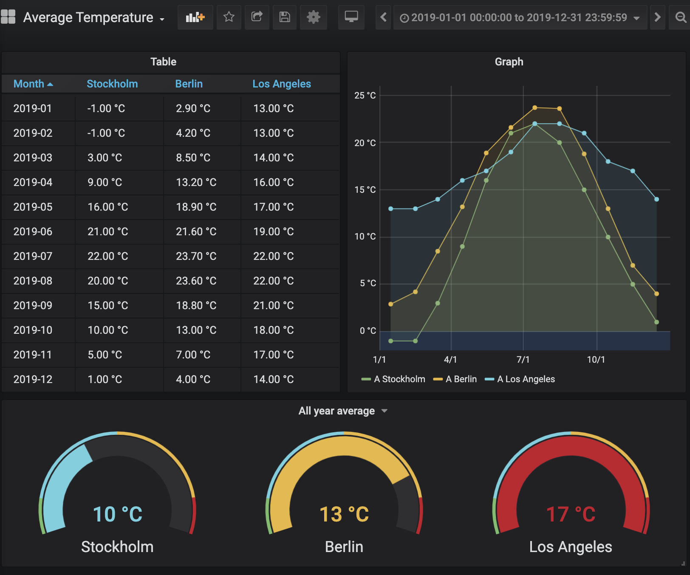
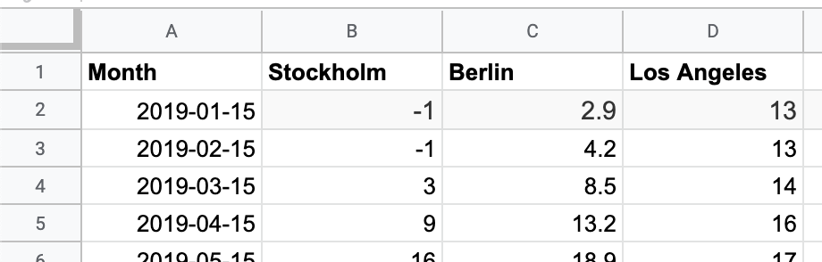

# Google Sheets data source

Visualize your Google Spreadsheets with Grafana





## Documentation

Check the [docs](https://github.com/grafana/google-sheets-datasource/blob/master/src/README.md) for information on how to use the data source.

## Development

You need to install the following first:

- [Mage](https://magefile.org/)
- [Yarn](https://yarnpkg.com/)
- [Docker Compose](https://docs.docker.com/compose/)

```BASH
mage watch
```

In another terminal

```BASH
docker-compose up
```

To restart after backend changes:
`./scripts/restart-plugin.sh`

### Test spreadsheet

Need at publicly available spreadsheet to play around with? Feel free to use [this](https://docs.google.com/spreadsheets/d/1TZlZX67Y0s4CvRro_3pCYqRCKuXer81oFp_xcsjPpe8/edit?usp=sharing) demo spreadsheet that is suitable for visualization in graphs and in tables.
