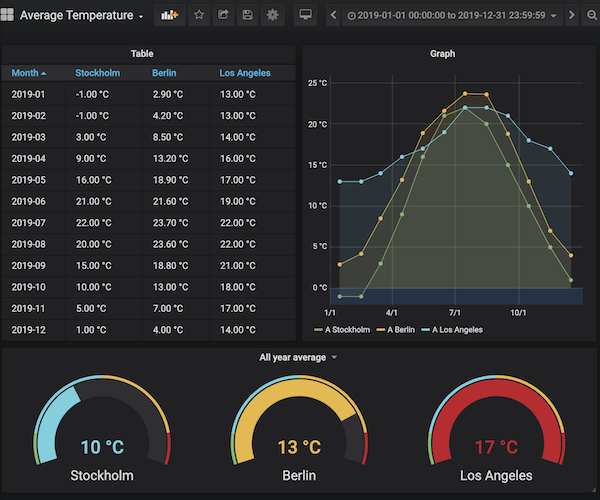
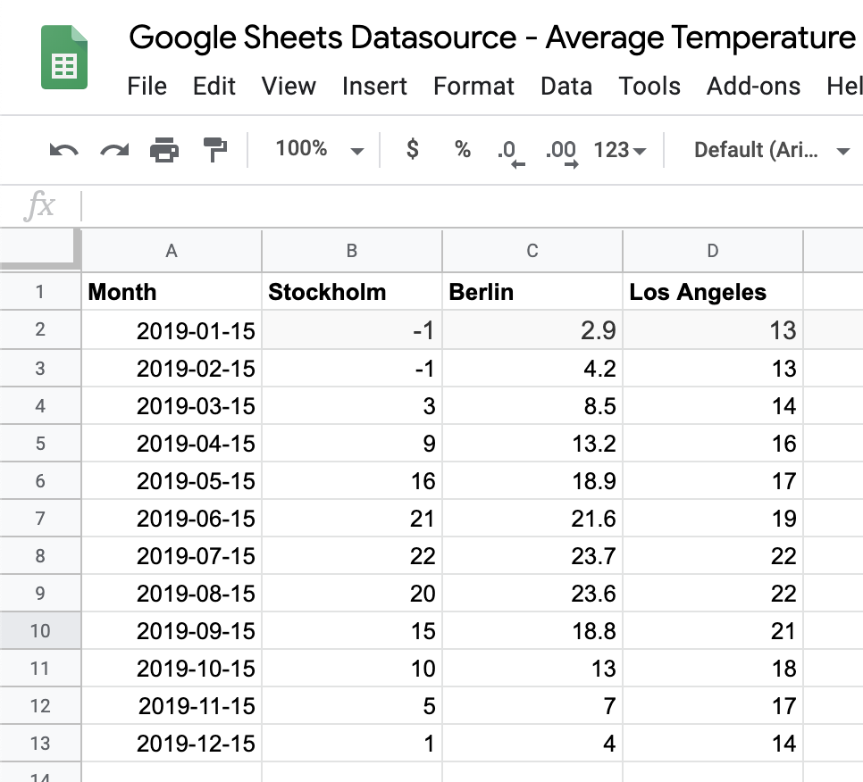

# Google Sheets Datasource

Visualize your Google Spreadsheets in Grafana!

## Configuration

Please refer to the [configuration](./docs/configuration.md) document.

## Using the editor

Please refer to the [Using the editor](./docs/using-the-editor.md) document.
