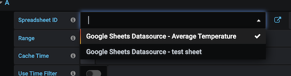
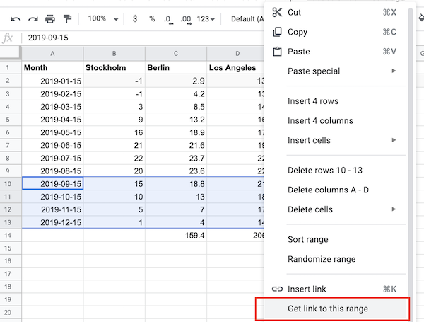

# Using the editor

Please refer to the Google Sheets API [common terms](https://developers.google.com/sheets/api/guides/concepts#spreadsheet_id) to get detailed information on what **spreadsheet ID** and **range** is.

## Spreadsheet ID

Once the **Spreadsheet ID** field is clicked, you have the following options:

- Enter a spreadsheet ID
- Enter a spreadsheet URL. The query editor will then extract the spreadsheet ID from the URL.
- Select a spreadsheet from the dropdown. The dropdown will only be populated if [Google JWT File](./configuration.md) auth is used and as long as spreadsheets are shared with the service account. Read about configuring JWT Auth [here](./configuration.md).
  
- Enter a link to a certain range. The query editor will then extract both spreadsheet ID and range from the URL. To copy a range, open the Spreadsheet and select the cells that you want to include. Then right click and select `Get link to this range`. The link will be stored in the clipboard.  
  

Right next to the Spreadsheet ID input field there's <i class="fa fa-external-link"></i> button. If you click on that button, the spreadsheet will be opened in Google Sheets in a separate tab.

## Range

[A1 notation](https://developers.google.com/sheets/api/guides/concepts#a1_notation) is used to specify the range. If the range field is left blank, the Google Sheet API will return the whole first sheet in the spreadsheet.

## Cache time

The Google Sheets data source has a caching feature that makes it possible to cache the Spreadsheet API response. The cache key is a combination of spreadsheet ID and range. The default cache time is set to five minutes, but that can be changed by selecting another option from the **Cache Time** field. By setting cache time to `0s`, the cache will be bypassed.

## Time filter

In case the Google Sheets data source was able to parse all cells in a column to the [Golang Time](https://golang.org/pkg/time/) data type, you'll be able to filter out all the rows in the Spreadsheet that are outside the bounds of the time range that is specified in the dashboard in Grafana. To do that you need to enable the **Use Time Filter** option in the query editor. This feature might be useful when you want to visualize spreadsheet data using a Graph panel.
